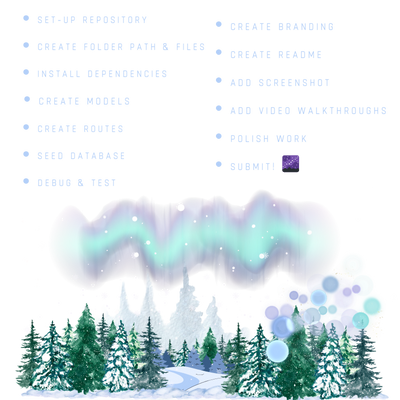
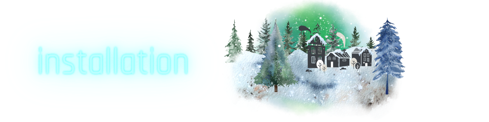

<p align="center">

</p>

[](https://opensource.org/licenses/MIT)
[](https://nodejs.org/en)
[](https://www.mysql.com)
[](https://expressjs.com/)
[](https://canva.com)

[](https://canva.com)
[](https://www.npmjs.com/package/nodemon)
[](https://canva.com/) 
[](https://canva.com/) 

[](https://canva.com/) 


### 

  - [OVERVIEW](#overview)
    - [*user story*](#user-story)
    - [*acceptance criteria*](#acceptance-criteria)
    - [*aurora borea-list*](#borea-list)
  - [INSTALLATION](#installation)
  - [USAGE](#usage)
    - [*screenshot*](#screenshot)
    - [*demo*](#demo)
  - [TESTING](#testing)
  - [SOURCES](#sources)
  - [LICENSE](#license)
  - [LINKS](#links)
  - [CONNECT](#connect)

  ### 

`STARRY CELLAR STUFF` is an e-commerce site that utilizes an [Express.js](https://expressjs.com/) RESTful API which uses [Sequelize](https://www.npmjs.com/package/sequelize) ORM to handle data storage and retriveal.
* [MySQL2](https://www.npmjs.com/package/mysql2) and [Sequelize](https://www.npmjs.com/package/sequelize) packages to connect `STARRY CELLAR STUFF's` Express RESTful API to a MySQL *database*.
* [dotenv](https://www.npmjs.com/package/dotenv) package to use environment variables to store sensitive data.

### 
<p align="center">
  
</p>

### 
<p align="center">
  
</p>

### 
<p align="center">
  
</p>

#

### 

The application is invoked using the following commands:

##### *Clone the repository in your local development enviornment.*

```
git clone https://github.com/christiecamp/starry-cellar.git
```
##### **Update *.env* with your information**

##### *Navigate to the command line and input:*

```javascript
npm i :: express, mysql2, dotenv --save, sequelize, -g nodemon --save-dev,
```
```javascript
mysql -u root -p
```
```mysql
SOURCE lib/db/schema.sql;
quit
```
```javascript
npm run seed
```
```javascript
nodemon server
```

### 

**INSTRUCTIONS:**

1. Open the Integrated Terminal and follow the [installation](#installation) guidelines

2. Interact with STARRY CELLAR STUFF's back end with [Insomnia](https://www.npmjs.com/package/inquirer/v/8.2.4) by testing the below:
      * GET all categories, products, tags
      * GET category, product, tag by id
      * CREATE category, product, tag
      * UPDATE category, product, tag
      * DELETE category, product, tag

      ##### view [demo videos](#demo) and [testing](#testing) 


### 
        
        
##### *Screenshot demonstrates testing with Insomnia*

<p align="center">

</p>


### 

##### **categories**

<p align="left">

</p>

##### **products**

<p align="left">

</p>


##### **tags**

<p align="left">

</p>


<!--  -->

### 

**TESTING WITH INSOMNIA:**

There are different tools available that can test reading/writing operations in a web browser - in this application we use [Insomnia](https://insomnia.rest/), a *REST client* that makes it easy to send **HTTP requests** to an API and view response details. 

1. After installing Insomnia, open a new document.

2. Interact with `STARRY CELLAR STUFF's` back end  by testing the below commands:

##### **GET** all categories, products, tags
```json
http://localhost:3013/api/categories
```
```json
http://localhost:3013/api/tags
```
```json
http://localhost:3013/api/products
```


##### **GET** category by *id*
```json
http://localhost:3013/api/categories/1
```

##### **CREATE** product
```json
http://localhost:3013/api/products/
```
```json
{
	"product_name": "",
	"price": 1.00,
	"stock": 1,
	"tag_id": [1, 2, 3]
}
```

##### **UPDATE** tag
```json
http://localhost:3013/api/tags/6
```
```json
{
  "tag_name": ""
}
```
##### **DELETE** category
```json
http://localhost:3013/api/categories/8
```


### 

Here's a list of technologies used:

1. [Node.js](https://nodejs.org/en) - is an open-source, cross-platform JavaScript runtime environment.

2. [Express.js]((https://expressjs.com)) - a minimal and flexible Node.js web application framework that provides a robust set of features for web and mobile applications.

3. [MySQL2](https://www.npmjs.com/package/mysql2) - MySQL is a relational database management system based on SQL – Structured Query Language.

4. [Dotenv](https://www.npmjs.com/package/dotenv) - a zero-dependency module that loads environment variables from a .env file into `process.env`.

5. [Sequelize](https://sequelize.org/) - a Node.js based `Object Relational Mapper` that makes it easy to work with **MySQL databases**. An *Object Relational Mapper* performs functions like handling database records by representing the data as objects.

6. [Nodemon](https://www.npmjs.com/package/nodemon) - a Node.js tool that helps develop applications by automatically restarting the node application when file changes in the directory are detected.

7. [Insomnia](https://insomnia.rest/) - an open source desktop application that assists in designing, debugging, and testing APIs (specifically in this instance, HTTP-based RESTful APIs).


### 

##### [mit license](./LICENSE)


### 

##### [*github repo*](https://github.com/christiecamp/starry-cellar)

##### **video demos**:
  * ##### [*full walkthrough*](https://drive.google.com/file/d/1g4kHC71UIPWrqOLdvLXGxl3Hohcrk7Vx/view)

  * ##### [*categories*](https://drive.google.com/file/d/1HW-IlwHodN4TjmZKsEg3YV_62NnA-n8R/view)

  * ##### [*products*](https://drive.google.com/file/d/1H2kOvExLJXJf2mxxH1CXzl1H49B9S1CJ/view) 

  * ##### [*tags*](https://drive.google.com/file/d/1O_VBx2V3qEoQv9pL0cAXOqN_yIqCZX2E/view)

### 

[](https://github.com/christiecamp/bear-taker)

<a href="mailto:christiecamphoto@gmail.com">

</a>

<p align="center">
<a href="https://www.christiecamp.com"></a>
</p>
